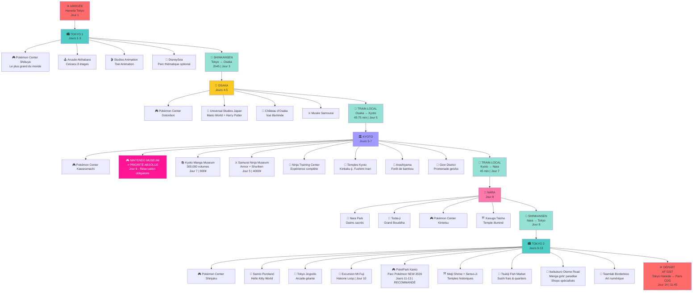

# 🎮 Japon 2026 - Aventure Pokémon & Parcs à Thème

Itinéraire complet pour un voyage de 14 jours au Japon (6-20 juillet 2026) centré autour de Pokémon, Nintendo et parcs à thème.

## 📋 Vue d'ensemble

| Aspect | Détail |
|--------|--------|
| **Dates** | 6 - 20 juillet 2026 |
| **Durée** | 14 jours / 13 nuits |
| **Route** | Tokyo → Osaka → Kyoto → Nara → Mont Fuji → Tokyo |
| **Budget** | ~920€ sur place |
| **Transport** | JR Pass 7j + trajets individuels |
| **Hôtels** | 2-3★ (550-1200¥/nuit) |

## 🗺️ Visualisation du voyage

## 🗺️ Itinéraire jour par jour

### Semaine 1 : Tokyo & Découverte
- **Jour 1** (6 juil) : Arrivée Tokyo (05:55 Haneda) + installation hôtel
- **Jour 2** (7 juil) : Tournoi Sumo + Atelier Baguettes Ginza + Shibuya Sky + Tanabata Festival
- **Jour 3** (8 juil) : Pokémon Center Shibuya + Asakusa Temple

### Semaine 2 : Kansai Region  
- **Jour 4** (9 juil) : Samurai Combat Training + Akihabara Arcade → Osaka (Shinkansen) + Umeda Sky Building
- **Jour 5** (10 juil) : **Super Mario World - Universal Studios Japan (jour 1)**
- **Jour 6** (11 juil) : **Super Mario World - Universal Studios Japan (jour 2)**
- **Jour 7** (12 juil) : Château d'Osaka + Pokémon Center + Namco Arcade + Mario Kart Arcade
- **Jour 8** (13 juil) : Nara (Kasuga Taisha → Todai-ji) → Kyoto

### Semaine 3 : Kyoto
- **Jour 9** (14 juil) : **NINTENDO MUSEUM (Kyoto)** ⭐ - Réservation obligatoire 
- **Jour 10** (15 juil) : Pokémon Center + Atelier Hanko (Sceau) + Kyoto Tower + Gion District
- **Jour 11** (16 juil) : Fushimi Inari Gates + Samurai Walk + Yasaka Shrine (Gion Matsuri)
- **Jour 12** (17 juil) : Bain Public Traditionnel (Onsen/Sento) - Jour relaxation
- **Jour 13** (18 juil) : Ninja Training Centre + Kyoto International Manga Museum

### Semaine 4 : Retour Tokyo & Départ
- **Jour 14** (19 juil) : Retour Tokyo (Shinkansen) + Hei Shrine + Dernier dîner
- **Jour 15** (20 juil) : Départ Paris (11:45 Haneda) → Arrivée Paris CDG 19:30

## 🎯 Points forts du programme

### 🎮 Pokémon Centers (5 visites confirmées)
1. **Tokyo Shibuya** - Le plus grand du monde | Jour 3
2. **Osaka Dotonbori** | Jour 7
3. **Kyoto Kawaramachi** | Jour 10
4. **Nara** | Jour 8 (optional via Kasuga Taisha)

### 🎢 Parcs à Thème Principaux
- **🍄 SUPER MARIO WORLD - Universal Studios Japan** ⭐
  - Jour 5-6 (2 jours complets)
  - Super Nintendo World + Harry Potter + attractions
  - Mario Kart, Yoshi Adventure, interactive zones
  - Budget : ~9000-11000¥/jour
  
- **🎮 NINTENDO MUSEUM (Kyoto)** ⭐ PRIORITÉ ABSOLUE
  - Jour 9 (14 juillet)
  - Réservation OBLIGATOIRE : nintendo-museum.jp/en/
  - Game Boy, NES, SNES, Wii, Switch (historique Nintendo)
  - Budget : 3000¥ (réservé)

### 🏯 Culture & Expériences Authentiques
- **Tournoi de Sumo** - Arashio Beya (Jour 2)
- **Atelier Baguettes** - Ginza (Jour 2)
- **Samurai Combat Training** (Jour 4)
- **Shibuya Sky** - Vue panoramique 360° (Jour 2)
- **Fushimi Inari** - 10 000 torii rouges (Jour 11)
- **Samurai Walk** - Expérience guidée (Jour 11)
- **Bain Public (Onsen/Sento)** - Jour relaxation (Jour 12)
- **Ninja Training Centre** - Shuriken & techniques (Jour 13)
- **Kyoto International Manga Museum** - 300 000+ mangas (Jour 13)
- **Atelier Hanko** - Sceau japonais personnalisé (Jour 10)
- **Gion Matsuri Festival** - Festival traditionnel (Jour 11)
- **Kasuga Taisha** - Temple lumineux à Nara (Jour 8)
- **Hei Shrine** - Sanctuaire forestier Tokyo (Jour 14)

### 🎮 Gaming & Arcade
- **Mario Kart Arcade Grand Prix** - Simulateur réaliste (Jour 7)
- **Namco Arcade** - Jeux rétro & modernes (Jour 7)
- **Akihabara** - Quartier électronique (Jour 4)

## 🆕 Nouvelles attractions & bonus 2026

### 🎮 PokéPark Kanto ⭐ À AJOUTER
**Le plus grand parc Pokémon permanent du monde - OUVERT FÉVRIER 2026**
- **Localisation** : Yomiuriland, Tokyo
- **Taille** : 26 000 m² d'expériences immersives
- **Attractions** : Pokémon Forest, Sedge Town, 600+ personnages Pokémon
- **Recommandation** : Ajouter aux jours flexibles (11-13) - jour complet conseillé
- **Accès** : ~30 min du centre de Tokyo

### 🏛️ Réouvertures importantes
- **Edo-Tokyo Museum** (31 mars 2026) - Histoire complète de Tokyo
- **Shuri Castle** (automne 2026) - Okinawa (au-delà du scope actuel)

### 📍 Top attractions - Manga, Ninja, Samurai

**Kyoto - Culture Geek & Historique** ⭐
- **Kyoto International Manga Museum** ⭐ (300,000+ manga volumes!)
  - Ancien école primaire convertie
  - Lecture sur place tous les titres
  - Coût : 900¥ | Temps : 2-3h
- **Samurai Ninja Museum Kyoto With Experience**
  - Porter armure samouraï, shuriken throwing, techniques ninja
  - Guides en anglais, 7j/7 (09:00-18:30)
  - Packages à différents prix
  - À 3 min de Kyoto-Kawaramachi Station

**Tokyo - Anime & Fashion Districts**
- **Ikebukuro Otome Road** ⭐
  - Manga boys' love, shops spécialisés
  - Complément féminin d'Akihabara
  - À 20 min du centre Tokyo
- **Akihabara** (déjà au programme ✓)
  - "Electric Town" - épicentre anime
  - Shops spécialisés, arcades

**Autres temples** (déjà couvert ✓)
- Meiji Shrine (gratuit, sanctuaire tranquille)
- Senso-Ji Temple (gratuit, 650 ans)
- Kinkaku-ji, Ginkaku-ji, Fushimi Inari (Kyoto)

**Events & Festivals 2026**
- 🎆 Summer Festivals (juillet) - Illuminations, feux d'artifice, street food

## 🎌 Points forts - Jours Kyoto (5-7)

Kyoto offre une plongée complète dans la culture geek + historique :

### **Jour 5 - Arrivée Kyoto + Découverte Samurai**
- **Samurai Ninja Museum Kyoto With Experience** ⭐
  - **Expériences** : Porter armure samouraï, shuriken throwing, techniques ninja
  - **Bâtiment** : Entre Nishiki Market et Gion (centre touristique)
  - **Guides** : En anglais, guides amicaux et informés
  - **Coût** : Packages à différents prix (~3000-5000¥ avec expériences)
  - **Horaires** : 09:00-18:30 (ouvert 7j/7)
  - **Accès** : 3 min de Kyoto-Kawaramachi Station
  - **Temps** : 2-3h recommandé

### **Jour 6 - Nintendo Museum** (voir détails précédents) ✓

### **Jour 7 - Manga Museum + Ninja Training + Nature**
- **Kyoto International Manga Museum** ⭐
  - **Collection** : 300,000+ manga volumes (floor-to-ceiling shelves)
  - **Bâtiment** : Ancien école primaire convertie (charme authentique)
  - **Concept** : Combinaison musée + bibliothèque
  - **Libre accès** : Lire tous les titres sur place
  - **Coût** : 900¥ adultes, 400¥ enfants
  - **Horaires** : Mercredi-Lundi (fermé mardi)
  - **Temps** : 2-3h
  - **Localisation** : Centre Kyoto, facile d'accès
  
- **Ninja Training Center** (existant ✓)
- **Arashiyama Bamboo Grove** (existant ✓)

---

## 📅 Détails - Jours flexibles (11-13)

Ces 3 jours vous offrent plusieurs excellentes options à combiner selon votre énergie :

### 🎮 **Option 1 : PokéPark Kanto** ⭐ RECOMMANDÉ
- **Pourquoi** : Parc Pokémon permanent le plus grand du monde (NEW 2026)
- **Durée** : Jour complet (8h-18h)
- **Coût** : 7000-8000¥ + 1000¥ transport
- **Accès** : Yomiuriland, ~30 min de Shinjuku

### ⛩️ **Option 2 : Meiji Shrine + Senso-Ji Temple**
- **Meiji Shrine** (Shibuya/Shinjuku)
  - Sanctuaire tranquille, 100 000 arbres
  - Gratuit | Matin conseillé (moins de monde)
- **Senso-Ji Temple** (Asakusa)
  - Temple bouddhiste 650 ans, lanterne rouge emblématique
  - Gratuit | Marché traditionnel à proximité
- **Durée** : Demi-jour à jour complet
- **Transport** : Métro Tokyo (800¥)

### 🍣 **Option 3 : Tsukiji Fish Market + quartiers**
- **Tsukiji Market**
  - Marché traditionnel, sushi frais, fruits de mer
  - Meilleurs prix à Tokyo
  - Meilleur moment : 5h-10h
- **Quartiers à explorer**
  - **Ikebukuro Otome Road** ⭐ (manga boys' love, shops spécialisés) - 20 min du centre
  - Harajuku (fashion & jeunesse)
  - Akihabara (anime electric town)
  - Ginza (luxe & shopping)
  - Roppongi (nightlife)
- **Durée** : 1-2 jours

### 🎭 **Option 4 : Teamlab Borderless**
- **Type** : Exposition d'art numérique immersive
- **Durée** : 3-4h
- **Coût** : 3200¥
- **Ambiance** : Surréaliste, très populaire

### 💡 **Combinaison suggérée**
- **Jour 11** : PokéPark Kanto (jour complet)
- **Jour 12** : Meiji Shrine (matin) + Tsukiji Market (midi) + Teamlab (après-midi)
- **Jour 13** : Exploration libre + shopping Pokémon (Akihabara, Harajuku) + Senso-Ji Temple

## 🎌 Recommandations - Manga, Ninja, Samurai Experience

### Pour une immersion complète dans la culture geek + historique

**✅ Ordre recommandé des jours Kyoto :**

1. **Jour 5 (Arrivée)** : Samurai Ninja Museum d'abord
   - Acclimatation à Kyoto + démarrage immersif
   - 2-3h en fin d'après-midi après arrivée
   - Lieux intéressants autour (Nishiki Market, Gion)

2. **Jour 6** : Nintendo Museum (priorité absolue)
   - Jour complet, réservation confirmée
   - Focus culture Nintendo

3. **Jour 7** : Manga Museum + Ninja Training
   - Matin : Kyoto International Manga Museum (2-3h)
   - Après-midi : Ninja Training Center
   - Fin de journée : Arashiyama bamboo + Gion

**✅ À Tokyo (jours 11-13) :**
- Combiner PokéPark Kanto + Ikebukuro Otome Road
- Jour 12 : Matin Meiji Shrine → Midi Tsukiji → Soir Teamlab
- Jour 13 : Ikebukuro (Otome Road) + shopping Akihabara

### 💡 Pourquoi ces attractions

| Attraction | Pourquoi | Temps |
|-----------|---------|-------|
| Samurai Ninja Museum | Expérience hands-on (armure, shuriken, ninja) | 2-3h |
| Manga Museum Kyoto | Immense collection (300,000 volumes), authentique | 2-3h |
| Ikebukuro Otome Road | Complément féminin Akihabara, manga spécialisé | 2-3h |
| PokéPark Kanto | Parc thématique dédié (26,000 m²) | Jour complet |

### 🎯 Thèmes couverts par ton itinéraire

- ✅ **Pokémon** : 5 Centers + PokéPark Kanto
- ✅ **Nintendo** : Nintendo Museum (priorité absolue)
- ✅ **Manga** : Kyoto Manga Museum (300,000 volumes)
- ✅ **Anime** : Akihabara, Ikebukuro Otome Road
- ✅ **Ninja** : Ninja Training Center + Samurai Ninja Museum
- ✅ **Samurai** : Samurai Museum Osaka + Samurai Ninja Museum Kyoto
- ✅ **Culture** : Temples, sanctuaires, festivals d'été
- ✅ **Parc à thème** : USJ Super Nintendo World

---

## 💰 Budget Détaillé Actualisé

### Hébergement (14 nuits)
- Tokyo 1 (Jours 1-3) : 3 nuits × 850¥ = 2550¥
- Osaka (Jours 4-7) : 4 nuits × 800¥ = 3200¥
- Kyoto (Jours 8-13) : 6 nuits × 800¥ = 4800¥
- Tokyo 2 (Jour 14) : 1 nuit × 850¥ = 850¥
- **Sous-total** : ~11 400¥ (~78€)

### Transport Interne
- Aéroport → Tokyo (N'EX) : 3000¥
- Shinkansen Tokyo → Osaka : 13 320¥
- Nara → Kyoto : 1100¥
- Shinkansen Kyoto → Tokyo : 13 320¥
- Métros & locaux : ~5000¥
- **Sous-total** : ~35 740¥ (~240€)

### Parcs & Attractions
- **Super Mario World (USJ, 2 jours)** : 9000¥ × 2 = 18 000¥
- **Nintendo Museum** : 3000¥ (réservé)
- Arashio Sumo : 2500¥
- Shibuya Sky : 3000¥
- Atelier Baguettes Ginza : 4000¥
- Samurai Combat Training : 4000¥
- Umeda Sky Building : 1500¥
- Château d'Osaka : 600¥
- Kasuga Taisha & Todai-ji : 1200¥
- Atelier Hanko : 4000¥
- Kyoto Tower : 800¥
- Fushimi Inari : Transport 1000¥
- Samurai Walk : 4000¥
- Bain Public (Onsen) : 1500¥
- Ninja Training : 4000¥
- Kyoto Manga Museum : 900¥
- Hei Shrine : 0¥ (gratuit)
- Autres temples & entrées : ~3000¥
- **Sous-total** : ~61 400¥ (~420€)

### Gaming & Arcade
- Akihabara Arcade (Ceicacu) : 3000¥
- Namco Arcade (tokens) : 3000¥
- Mario Kart Arcade : 1000¥
- Asakusa visits : 1000¥
- **Sous-total** : ~8000¥ (~55€)

### Pokémon Centers & Shopping
- Tokyo Shibuya Center : 8000¥
- Osaka Center : 5000¥
- Kyoto Center : 5000¥
- **Sous-total** : ~18 000¥ (~120€)

### Repas & Divers
- Repas (~2000-3000¥/jour × 14j) : ~35 000¥
- Tanabata Festival repas : 2500¥
- Gion Festival repas : 2000¥
- Snacks & shopping : ~4000¥
- **Sous-total** : ~43 500¥ (~295€)

---

### **TOTAL ESTIMATION : ~178 540¥ (~1210€)**

*Détail par catégorie :*
- Hébergement : 11 400¥ (78€)
- Transport : 35 740¥ (240€)
- Attractions & Parcs : 61 400¥ (420€)
- Gaming & Arcade : 8000¥ (55€)
- Shopping : 18 000¥ (120€)
- Repas & Divers : 43 500¥ (295€)

**Note :** Vols internationaux non inclus (Air France déjà payés)

## 🎫 Priorités absolues

### 1. Nintendo Museum Kyoto ⚠️
- **Dates** : Jour 6 (16 juillet recommandé)
- **Réservation** : https://www.nintendo-museum.jp/en/
- **Créneau recommandé** : 10h-12h (après-midi libre)
- **Prix** : ~3000¥
- **Action** : Réserver immédiatement (juillet = haute saison)

### 2. Hôtels
- Booking.com, Agoda, jalan.net, rakuten.co.jp
- Réserver avant mai (juillet = haute saison)
- Budget 600-1000¥/nuit pour qualité correcte

### 3. USJ & autres parcs
- Réserver en ligne pour files courtes
- Shinkansen : réserver le moins tard possible

## 🚄 Transport - JR Pass ou à l'unité ?

| Option | Coût | Avantages |
|--------|------|-----------|
| **7-day JR Pass** | ~29 650¥ | Illimité Shinkansen, économe long trajet |
| **À l'unité** | ~25 000¥ | Plus flexible, légèrement moins cher |

**Conseil** : JR Pass 7j (jours 3-9) pour Tokyo→Osaka→Kyoto→Nara→Tokyo

## 📱 Conseils pratiques

### 💳 Argent & Paiements
- Retirer Yen à l'aéroport
- Peu de cartes acceptées → préférer espèces
- Suica/Pasmo rechargeable pour transports publics

### 📲 Connexion & Navigation
- SIM temporaire ou WiFi pocket à l'aéroport
- Google Maps (100% fiable au Japon)
- Google Translate pour étiquettes/menus

### 🎫 Billets & Réservations
- **Pokémon Centers** : walk-in (aucune réservation)
- **Parcs à thème** : réserver en ligne (files courtes)
- **Shinkansen** : réserver en ligne (sièges numérotés)

### 🗺️ Applications utiles
- Google Maps (transport public intégré)
- Hyperdia (horaires train détaillés)
- JR East Pass (app officielle)

## ✅ Checklist avant départ

**Réservations (URGENT)**
- [ ] Nintendo Museum Kyoto
- [ ] Hôtels (Tokyo, Osaka, Kyoto, Nara)
- [ ] USJ billets en ligne
- [ ] Disneyland (optionnel)
- [ ] Shinkansen Tokyo↔Osaka

**Préparation**
- [ ] Passeport valide (6+ mois)
- [ ] Assurance voyage
- [ ] JR Pass (à décider)
- [ ] SIM/WiFi pocket
- [ ] Google Maps hors-ligne

## 📄 Source

Itinéraire généré à partir du fichier HTML `japan_trip_itinerary.html` (27 avril 2026)

---

**🎮 Bon voyage au Japon ! 🗾**
