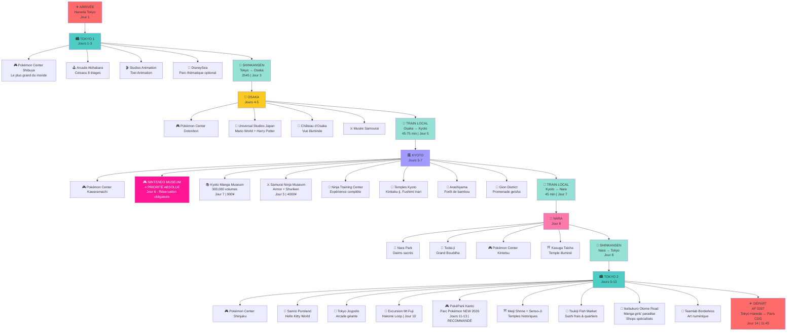

# 🎮 Japon 2026 - Aventure Pokémon & Parcs à Thème

Itinéraire complet pour un voyage de 14 jours au Japon (6-20 juillet 2026) centré autour de Pokémon, Nintendo et parcs à thème.

## 📋 Vue d'ensemble

| Aspect | Détail |
|--------|--------|
| **Dates** | 6 - 20 juillet 2026 |
| **Durée** | 14 jours / 13 nuits |
| **Route** | Tokyo → Osaka → Kyoto → Nara → Mont Fuji → Tokyo |
| **Budget** | ~920€ sur place |
| **Transport** | JR Pass 7j + trajets individuels |
| **Hôtels** | 2-3★ (550-1200¥/nuit) |

## 🗺️ Visualisation du voyage

## 📅 Itinéraire jour par jour

### ✈️ SEMAINE 1 : ARRIVÉE TOKYO & DÉCOUVERTE (6-8 juil)

#### 🛬 **Jour 1 | Lundi 6 juillet - ARRIVÉE**
- **05:55** ✈️ Arrivée Haneda Terminal 3
- **06:30-07:30** 🚆 Transfert aéroport (N'EX ou Keisei) → Hôtel
- **08:00-18:00** 🏨 Installation hôtel + repos décalage horaire
- **18:00-21:00** 🌆 Découverte locale : Shinjuku Crossing, Harajuku Takeshita Street

---

#### ⚡ **Jour 2 | Mardi 7 juillet - SUMO, CULTURE & FESTIVAL**
| Horaire | Activité | 📍 Localisation | 💰 Coût |
|---------|----------|-----------------|---------|
| **06:30-11:00** | 🤼 **Tournoi Sumo** Arashio beya | Tokyo | 2500¥ |
| **12:00-14:00** | 🥢 **Atelier Baguettes** (Hashi) | Ginza | 4000¥ |
| **14:30-18:00** | 🌇 **Shibuya Sky** Vue panoramique 360° (46e étage) | Shibuya | 3000¥ |
| **19:00-22:00** | ✨ **Fête Tanabata** (Festival des étoiles) | Omoide Yokocho, Shinjuku | 2500¥ |

**Total Jour 2 :** ~12 000¥ | **Repas :** ~2000-3000¥

---

#### 🎮 **Jour 3 | Mercredi 8 juillet - POKÉMON CENTER & ASAKUSA**
| Horaire | Activité | 📍 Localisation | 📌 Notes |
|---------|----------|-----------------|---------|
| **09:00-12:00** | 🎮 **Pokémon Center Shibuya** (le plus grand du monde) | Shibuya 109 Building | Shopping 5000-15000¥ |
| **13:00-17:00** | ⛩️ **Asakusa** Temple + rue commerçante | District traditionnel | Gratuit (street food ~2000¥) |
| **17:00-19:00** | 🏯 Senso-Ji Temple + marché Nakamise | Asakusa | Gratuit |
| **19:00-21:00** | 🍜 Repas traditionnel | Centre-ville | 2000-3000¥ |

**Métro Tokyo :** 800¥

---

### 🏯 SEMAINE 2 : OSAKA & SUPER MARIO WORLD (9-13 juil)

#### ⚔️ **Jour 4 | Jeudi 9 juillet - SAMURAI, AKIHABARA & DÉPART OSAKA**
| Horaire | Activité | Détails |
|---------|----------|---------|
| **08:00-10:00** | ⚔️ **Samurai Combat Training** | Techniques + combats (2h) - 4000¥ |
| **11:00-13:00** | 🕹️ **Akihabara Arcade** | Ceicacu 8 étages, jeux rétro - 3000¥ |
| **14:15-17:00** | 🚄 **Shinkansen Tokyo → Osaka** | 2h45, classe économique - 13 320¥ |
| **18:00-20:00** | 🌃 **Umeda Sky Building** | Sky Walk + marché gastronomique - 1500¥ |
| **20:00-22:00** | 🏨 Hôtel Installation + repos | Namba/Shinsaibashi |

---

#### 🍄 **Jour 5 | Vendredi 10 juillet - SUPER MARIO WORLD (Jour 1)**
| | Activité |
|---|----------|
| **08:30** | Arrivée USJ (ouverture) |
| **09:00-22:00** | 🎢 **Universal Studios Japan - Super Nintendo World** |
| | • Mario Kart (ride principal) |
| | • Yoshi Adventure |
| | • Donkey Kong Mine Cart |
| | • Photo spots immersifs |
| | • Restaurants thématisés |
| **Billet** | 9000-11000¥ + Express Pass optionnel (4000-6000¥) |
| **Repas/Shopping** | ~5000¥ |

---

#### 🍄 **Jour 6 | Samedi 11 juillet - SUPER MARIO WORLD (Jour 2)**
| | Détails |
|---|---------|
| **Jour entier** | 🎢 **USJ Super Nintendo World** |
| **Objectifs** | Refaire rides + shopping détaillé + jeux interactifs |
| **Billet** | 8000-10000¥ (jour supplémentaire ou pass 2 jours) |
| **Conseil** | Arrivée 8h30 - files moins longues le samedi en fin de jour |

---

#### 🏯 **Jour 7 | Dimanche 12 juillet - CHÂTEAU OSAKA & GAMING**
| Horaire | Activité | 💰 Coût |
|---------|----------|---------|
| **09:00-11:00** | 🏯 **Château d'Osaka** + parc | 600¥ |
| **12:00-13:30** | 🎮 **Pokémon Center** Dotonbori | 5000¥ shopping |
| **14:00-16:00** | 🕹️ **Namco Arcade** (tokens pour jeux) | 3000¥ |
| **17:00-18:30** | 🏎️ **Mario Kart Arcade Grand Prix** | 1000¥ |
| **19:00-21:00** | 🍜 Repas Dotonbori | 2000-3000¥ |

---

#### 🦌 **Jour 8 | Lundi 13 juillet - NARA & DÉPART KYOTO**
| Horaire | Activité | Détails |
|---------|----------|---------|
| **08:30-09:15** | 🚄 **Train Osaka → Nara** | 30-45 min (800-1100¥) |
| **10:00-14:00** | 🦌 **Nara** • Kasuga Taisha (temple lanternes rouges) • Todai-ji (Grand Bouddha 15m) • Nara Park (daims sacrés gratuit) | 600-800¥ temples 3-4h total |
| **15:00-16:00** | 🚄 **Train Nara → Kyoto** | 45-60 min (1100¥) |
| **16:30-18:00** | 🏨 Arrivée Kyoto + installation |  |

---

### 🏛️ SEMAINE 3 : KYOTO CULTURE & GEEK (14-18 juil)

#### 🎮 **Jour 9 | Mardi 14 juillet - NINTENDO MUSEUM ⭐**
| | Détails |
|---|---------|
| **PRIORITÉ ABSOLUE** | ✅ Réservation confirmée : nintendo-museum.jp/en/ |
| **10:00-12:00** | 🎮 **Nintendo Museum** (créneau 2h) |
| | • Histoire Nintendo (Game Boy → Switch) |
| | • Consoles rares & prototypes |
| | • Zones interactives jouables |
| | • Boutique exclusive |
| **Après-midi** | Visite temples optionnels (Kinkaku-ji, Fushimi Inari) |
| **Billet** | 3000¥ (RÉSERVÉ) + shopping ~3000-5000¥ |

---

#### 🎨 **Jour 10 | Mercredi 15 juillet - POKÉMON, HANKO & KYOTO TOWER**
| Horaire | Activité | 💰 Coût |
|---------|----------|---------|
| **10:00-11:30** | 🎮 **Pokémon Center Kyoto** | 5000¥ shopping |
| **12:00-14:00** | 📿 **Atelier Fabrication Sceau (Hanko)** | 4000¥ |
| **14:30-16:30** | 🏯 **Kyoto Tower** Vue panoramique 100m | 800¥ |
| **17:00-19:30** | 🌃 **Gion District** Promenade geisha + dîner | 3000¥ repas |

---

#### ⛩️ **Jour 11 | Jeudi 16 juillet - FUSHIMI INARI & GION MATSURI**
| Horaire | Activité | Détails |
|---------|----------|---------|
| **07:00-10:30** | ⛩️ **Fushimi Inari Gates** | 10 000 torii rouges, sentiers montagne |
| | | Arriver tôt = moins foules (gratuit) |
| **12:00-14:30** | ⚔️ **Samurai Walk** | Marche historique + photos (4000¥) |
| **17:00-21:00** | 🎆 **Gion Matsuri Festival** | Sanctuaire Yasaka, processions, street food |
| | | Lanternes flottantes, atmosphère festive |

**Transport Fushimi Inari :** 1000¥ | **Repas Festival :** 2000-3000¥

---

#### ♨️ **Jour 12 | Vendredi 17 juillet - BAIN PUBLIC TRADITIONNEL**
| | Activité |
|---|----------|
| **Jour relaxation** | 🧘 Journée bien-être |
| **Options Kyoto** | • Makoto no yu (traditionnel populaire) |
| | • Funaoka Onsen (eau thermale luxe) |
| | • Fu fu no yu Onsen (complexe complet) |
| | • Hanano Yu (petite sento bien notée) |
| **Horaires** | 15h-23h typique (vérifier à l'hôtel) |
| **Coût** | 600-2000¥ selon établissement |
| **Programme** | Petit-déjeuner tardif → Bain 15h-18h → Dîner local → Repos |

---

#### 🥋 **Jour 13 | Samedi 18 juillet - NINJA TRAINING & MANGA MUSEUM**
| Horaire | Activité | 💰 Coût |
|---------|----------|---------|
| **10:00-12:30** | 🥋 **Ninja Training Centre** | 4000¥ |
| | • Shuriken (étoiles) lancer |
| | • Techniques combat ninja |
| | • Costume ninja inclus parfois |
| **13:30-16:30** | 📚 **Kyoto International Manga Museum** | 900¥ |
| | • 300 000+ mangas à lire sur place |
| | • Floor-to-ceiling shelves |
| | • Ancien bâtiment école primaire |
| **17:00-20:00** | 🌆 Détente + préparation départ lendemain |  |

---

### 🚄 SEMAINE 4 : RETOUR TOKYO & DÉPART (19-20 juil)

#### 🏯 **Jour 14 | Dimanche 19 juillet - RETOUR TOKYO & HEI SHRINE**
| Horaire | Activité | Détails |
|---------|----------|---------|
| **09:00-11:45** | 🚄 **Shinkansen Kyoto → Tokyo** | 2h15-2h45, classe économique (13 320¥) |
| **12:30-14:00** | 🏨 Installation hôtel Tokyo retour | Shinjuku/Shibuya |
| **14:30-16:30** | ⛩️ **Hei Shrine** (Meiji Jingu area) | Forêt sacrée, gratuit, atmosphère paisible |
| **17:00-19:00** | 🌃 Exploration libre + shopping final |  |
| **19:30-21:30** | 🍜 **Dernier Dîner Tokyo** | Ramen, sushi, yakitori, okonomiyaki (2000-5000¥) |

---

#### ✈️ **Jour 15 | Lundi 20 juillet - DÉPART PARIS**
| Horaire | Activité | Détails |
|---------|----------|---------|
| **07:00-09:00** | 🎁 Petit-déjeuner + derniers achats |  |
| **09:30-11:15** | 🛫 Transfert Haneda | ~1h30 depuis hôtel |
| **11:45-23:15** | ✈️ **Vol AF 0287** Tokyo HND → Paris CDG | 12h30 de vol |
| **19:30** | 🏠 Arrivée Paris CDG | Retour à la maison ! |

---

## 🎯 RÉSUMÉ ACTIVITÉS CLÉS

## 🎯 Points forts du programme

### 🎮 Pokémon Centers (5 visites confirmées)
1. **Tokyo Shibuya** - Le plus grand du monde | Jour 3
2. **Osaka Dotonbori** | Jour 7
3. **Kyoto Kawaramachi** | Jour 10
4. **Nara** | Jour 8 (optional via Kasuga Taisha)

### 🎢 Parcs à Thème Principaux
- **🍄 SUPER MARIO WORLD - Universal Studios Japan** ⭐
  - Jour 5-6 (2 jours complets)
  - Super Nintendo World + Harry Potter + attractions
  - Mario Kart, Yoshi Adventure, interactive zones
  - Budget : ~9000-11000¥/jour
  
- **🎮 NINTENDO MUSEUM (Kyoto)** ⭐ PRIORITÉ ABSOLUE
  - Jour 9 (14 juillet)
  - Réservation OBLIGATOIRE : nintendo-museum.jp/en/
  - Game Boy, NES, SNES, Wii, Switch (historique Nintendo)
  - Budget : 3000¥ (réservé)

### 🏯 Culture & Expériences Authentiques
- **Tournoi de Sumo** - Arashio Beya (Jour 2)
- **Atelier Baguettes** - Ginza (Jour 2)
- **Samurai Combat Training** (Jour 4)
- **Shibuya Sky** - Vue panoramique 360° (Jour 2)
- **Fushimi Inari** - 10 000 torii rouges (Jour 11)
- **Samurai Walk** - Expérience guidée (Jour 11)
- **Bain Public (Onsen/Sento)** - Jour relaxation (Jour 12)
- **Ninja Training Centre** - Shuriken & techniques (Jour 13)
- **Kyoto International Manga Museum** - 300 000+ mangas (Jour 13)
- **Atelier Hanko** - Sceau japonais personnalisé (Jour 10)
- **Gion Matsuri Festival** - Festival traditionnel (Jour 11)
- **Kasuga Taisha** - Temple lumineux à Nara (Jour 8)
- **Hei Shrine** - Sanctuaire forestier Tokyo (Jour 14)

### 🎮 Gaming & Arcade
- **Mario Kart Arcade Grand Prix** - Simulateur réaliste (Jour 7)
- **Namco Arcade** - Jeux rétro & modernes (Jour 7)
- **Akihabara** - Quartier électronique (Jour 4)

## 🆕 Nouvelles attractions & bonus 2026

### 🎮 PokéPark Kanto ⭐ À AJOUTER
**Le plus grand parc Pokémon permanent du monde - OUVERT FÉVRIER 2026**
- **Localisation** : Yomiuriland, Tokyo
- **Taille** : 26 000 m² d'expériences immersives
- **Attractions** : Pokémon Forest, Sedge Town, 600+ personnages Pokémon
- **Recommandation** : Ajouter aux jours flexibles (11-13) - jour complet conseillé
- **Accès** : ~30 min du centre de Tokyo

### 🏛️ Réouvertures importantes
- **Edo-Tokyo Museum** (31 mars 2026) - Histoire complète de Tokyo
- **Shuri Castle** (automne 2026) - Okinawa (au-delà du scope actuel)

### 📍 Top attractions - Manga, Ninja, Samurai

**Kyoto - Culture Geek & Historique** ⭐
- **Kyoto International Manga Museum** ⭐ (300,000+ manga volumes!)
  - Ancien école primaire convertie
  - Lecture sur place tous les titres
  - Coût : 900¥ | Temps : 2-3h
- **Samurai Ninja Museum Kyoto With Experience**
  - Porter armure samouraï, shuriken throwing, techniques ninja
  - Guides en anglais, 7j/7 (09:00-18:30)
  - Packages à différents prix
  - À 3 min de Kyoto-Kawaramachi Station

**Tokyo - Anime & Fashion Districts**
- **Ikebukuro Otome Road** ⭐
  - Manga boys' love, shops spécialisés
  - Complément féminin d'Akihabara
  - À 20 min du centre Tokyo
- **Akihabara** (déjà au programme ✓)
  - "Electric Town" - épicentre anime
  - Shops spécialisés, arcades

**Autres temples** (déjà couvert ✓)
- Meiji Shrine (gratuit, sanctuaire tranquille)
- Senso-Ji Temple (gratuit, 650 ans)
- Kinkaku-ji, Ginkaku-ji, Fushimi Inari (Kyoto)

**Events & Festivals 2026**
- 🎆 Summer Festivals (juillet) - Illuminations, feux d'artifice, street food

## 🎌 Points forts - Jours Kyoto (5-7)

Kyoto offre une plongée complète dans la culture geek + historique :

### **Jour 5 - Arrivée Kyoto + Découverte Samurai**
- **Samurai Ninja Museum Kyoto With Experience** ⭐
  - **Expériences** : Porter armure samouraï, shuriken throwing, techniques ninja
  - **Bâtiment** : Entre Nishiki Market et Gion (centre touristique)
  - **Guides** : En anglais, guides amicaux et informés
  - **Coût** : Packages à différents prix (~3000-5000¥ avec expériences)
  - **Horaires** : 09:00-18:30 (ouvert 7j/7)
  - **Accès** : 3 min de Kyoto-Kawaramachi Station
  - **Temps** : 2-3h recommandé

### **Jour 6 - Nintendo Museum** (voir détails précédents) ✓

### **Jour 7 - Manga Museum + Ninja Training + Nature**
- **Kyoto International Manga Museum** ⭐
  - **Collection** : 300,000+ manga volumes (floor-to-ceiling shelves)
  - **Bâtiment** : Ancien école primaire convertie (charme authentique)
  - **Concept** : Combinaison musée + bibliothèque
  - **Libre accès** : Lire tous les titres sur place
  - **Coût** : 900¥ adultes, 400¥ enfants
  - **Horaires** : Mercredi-Lundi (fermé mardi)
  - **Temps** : 2-3h
  - **Localisation** : Centre Kyoto, facile d'accès
  
- **Ninja Training Center** (existant ✓)
- **Arashiyama Bamboo Grove** (existant ✓)

---

## 📅 Détails - Jours flexibles (11-13)

Ces 3 jours vous offrent plusieurs excellentes options à combiner selon votre énergie :

### 🎮 **Option 1 : PokéPark Kanto** ⭐ RECOMMANDÉ
- **Pourquoi** : Parc Pokémon permanent le plus grand du monde (NEW 2026)
- **Durée** : Jour complet (8h-18h)
- **Coût** : 7000-8000¥ + 1000¥ transport
- **Accès** : Yomiuriland, ~30 min de Shinjuku

### ⛩️ **Option 2 : Meiji Shrine + Senso-Ji Temple**
- **Meiji Shrine** (Shibuya/Shinjuku)
  - Sanctuaire tranquille, 100 000 arbres
  - Gratuit | Matin conseillé (moins de monde)
- **Senso-Ji Temple** (Asakusa)
  - Temple bouddhiste 650 ans, lanterne rouge emblématique
  - Gratuit | Marché traditionnel à proximité
- **Durée** : Demi-jour à jour complet
- **Transport** : Métro Tokyo (800¥)

### 🍣 **Option 3 : Tsukiji Fish Market + quartiers**
- **Tsukiji Market**
  - Marché traditionnel, sushi frais, fruits de mer
  - Meilleurs prix à Tokyo
  - Meilleur moment : 5h-10h
- **Quartiers à explorer**
  - **Ikebukuro Otome Road** ⭐ (manga boys' love, shops spécialisés) - 20 min du centre
  - Harajuku (fashion & jeunesse)
  - Akihabara (anime electric town)
  - Ginza (luxe & shopping)
  - Roppongi (nightlife)
- **Durée** : 1-2 jours

### 🎭 **Option 4 : Teamlab Borderless**
- **Type** : Exposition d'art numérique immersive
- **Durée** : 3-4h
- **Coût** : 3200¥
- **Ambiance** : Surréaliste, très populaire

### 💡 **Combinaison suggérée**
- **Jour 11** : PokéPark Kanto (jour complet)
- **Jour 12** : Meiji Shrine (matin) + Tsukiji Market (midi) + Teamlab (après-midi)
- **Jour 13** : Exploration libre + shopping Pokémon (Akihabara, Harajuku) + Senso-Ji Temple

## 🎌 Recommandations - Manga, Ninja, Samurai Experience

### Pour une immersion complète dans la culture geek + historique

**✅ Ordre recommandé des jours Kyoto :**

1. **Jour 5 (Arrivée)** : Samurai Ninja Museum d'abord
   - Acclimatation à Kyoto + démarrage immersif
   - 2-3h en fin d'après-midi après arrivée
   - Lieux intéressants autour (Nishiki Market, Gion)

2. **Jour 6** : Nintendo Museum (priorité absolue)
   - Jour complet, réservation confirmée
   - Focus culture Nintendo

3. **Jour 7** : Manga Museum + Ninja Training
   - Matin : Kyoto International Manga Museum (2-3h)
   - Après-midi : Ninja Training Center
   - Fin de journée : Arashiyama bamboo + Gion

**✅ À Tokyo (jours 11-13) :**
- Combiner PokéPark Kanto + Ikebukuro Otome Road
- Jour 12 : Matin Meiji Shrine → Midi Tsukiji → Soir Teamlab
- Jour 13 : Ikebukuro (Otome Road) + shopping Akihabara

### 💡 Pourquoi ces attractions

| Attraction | Pourquoi | Temps |
|-----------|---------|-------|
| Samurai Ninja Museum | Expérience hands-on (armure, shuriken, ninja) | 2-3h |
| Manga Museum Kyoto | Immense collection (300,000 volumes), authentique | 2-3h |
| Ikebukuro Otome Road | Complément féminin Akihabara, manga spécialisé | 2-3h |
| PokéPark Kanto | Parc thématique dédié (26,000 m²) | Jour complet |

### 🎯 Thèmes couverts par ton itinéraire

- ✅ **Pokémon** : 5 Centers + PokéPark Kanto
- ✅ **Nintendo** : Nintendo Museum (priorité absolue)
- ✅ **Manga** : Kyoto Manga Museum (300,000 volumes)
- ✅ **Anime** : Akihabara, Ikebukuro Otome Road
- ✅ **Ninja** : Ninja Training Center + Samurai Ninja Museum
- ✅ **Samurai** : Samurai Museum Osaka + Samurai Ninja Museum Kyoto
- ✅ **Culture** : Temples, sanctuaires, festivals d'été
- ✅ **Parc à thème** : USJ Super Nintendo World

---

## 💰 Budget Détaillé Actualisé

### Hébergement (14 nuits)
- Tokyo 1 (Jours 1-3) : 3 nuits × 850¥ = 2550¥
- Osaka (Jours 4-7) : 4 nuits × 800¥ = 3200¥
- Kyoto (Jours 8-13) : 6 nuits × 800¥ = 4800¥
- Tokyo 2 (Jour 14) : 1 nuit × 850¥ = 850¥
- **Sous-total** : ~11 400¥ (~78€)

### Transport Interne
- Aéroport → Tokyo (N'EX) : 3000¥
- Shinkansen Tokyo → Osaka : 13 320¥
- Nara → Kyoto : 1100¥
- Shinkansen Kyoto → Tokyo : 13 320¥
- Métros & locaux : ~5000¥
- **Sous-total** : ~35 740¥ (~240€)

### Parcs & Attractions
- **Super Mario World (USJ, 2 jours)** : 9000¥ × 2 = 18 000¥
- **Nintendo Museum** : 3000¥ (réservé)
- Arashio Sumo : 2500¥
- Shibuya Sky : 3000¥
- Atelier Baguettes Ginza : 4000¥
- Samurai Combat Training : 4000¥
- Umeda Sky Building : 1500¥
- Château d'Osaka : 600¥
- Kasuga Taisha & Todai-ji : 1200¥
- Atelier Hanko : 4000¥
- Kyoto Tower : 800¥
- Fushimi Inari : Transport 1000¥
- Samurai Walk : 4000¥
- Bain Public (Onsen) : 1500¥
- Ninja Training : 4000¥
- Kyoto Manga Museum : 900¥
- Hei Shrine : 0¥ (gratuit)
- Autres temples & entrées : ~3000¥
- **Sous-total** : ~61 400¥ (~420€)

### Gaming & Arcade
- Akihabara Arcade (Ceicacu) : 3000¥
- Namco Arcade (tokens) : 3000¥
- Mario Kart Arcade : 1000¥
- Asakusa visits : 1000¥
- **Sous-total** : ~8000¥ (~55€)

### Pokémon Centers & Shopping
- Tokyo Shibuya Center : 8000¥
- Osaka Center : 5000¥
- Kyoto Center : 5000¥
- **Sous-total** : ~18 000¥ (~120€)

### Repas & Divers
- Repas (~2000-3000¥/jour × 14j) : ~35 000¥
- Tanabata Festival repas : 2500¥
- Gion Festival repas : 2000¥
- Snacks & shopping : ~4000¥
- **Sous-total** : ~43 500¥ (~295€)

---

### **TOTAL ESTIMATION : ~178 540¥ (~1210€)**

*Détail par catégorie :*
- Hébergement : 11 400¥ (78€)
- Transport : 35 740¥ (240€)
- Attractions & Parcs : 61 400¥ (420€)
- Gaming & Arcade : 8000¥ (55€)
- Shopping : 18 000¥ (120€)
- Repas & Divers : 43 500¥ (295€)

**Note :** Vols internationaux non inclus (Air France déjà payés)

## 🎫 Priorités absolues

### 1. Nintendo Museum Kyoto ⚠️
- **Dates** : Jour 6 (16 juillet recommandé)
- **Réservation** : https://www.nintendo-museum.jp/en/
- **Créneau recommandé** : 10h-12h (après-midi libre)
- **Prix** : ~3000¥
- **Action** : Réserver immédiatement (juillet = haute saison)

### 2. Hôtels
- Booking.com, Agoda, jalan.net, rakuten.co.jp
- Réserver avant mai (juillet = haute saison)
- Budget 600-1000¥/nuit pour qualité correcte

### 3. USJ & autres parcs
- Réserver en ligne pour files courtes
- Shinkansen : réserver le moins tard possible

## 🚄 Transport - JR Pass ou à l'unité ?

| Option | Coût | Avantages |
|--------|------|-----------|
| **7-day JR Pass** | ~29 650¥ | Illimité Shinkansen, économe long trajet |
| **À l'unité** | ~25 000¥ | Plus flexible, légèrement moins cher |

**Conseil** : JR Pass 7j (jours 3-9) pour Tokyo→Osaka→Kyoto→Nara→Tokyo

## 📱 Conseils pratiques

### 💳 Argent & Paiements
- Retirer Yen à l'aéroport
- Peu de cartes acceptées → préférer espèces
- Suica/Pasmo rechargeable pour transports publics

### 📲 Connexion & Navigation
- SIM temporaire ou WiFi pocket à l'aéroport
- Google Maps (100% fiable au Japon)
- Google Translate pour étiquettes/menus

### 🎫 Billets & Réservations
- **Pokémon Centers** : walk-in (aucune réservation)
- **Parcs à thème** : réserver en ligne (files courtes)
- **Shinkansen** : réserver en ligne (sièges numérotés)

### 🗺️ Applications utiles
- Google Maps (transport public intégré)
- Hyperdia (horaires train détaillés)
- JR East Pass (app officielle)

## ✅ Checklist avant départ

**Réservations (URGENT)**
- [ ] Nintendo Museum Kyoto
- [ ] Hôtels (Tokyo, Osaka, Kyoto, Nara)
- [ ] USJ billets en ligne
- [ ] Disneyland (optionnel)
- [ ] Shinkansen Tokyo↔Osaka

**Préparation**
- [ ] Passeport valide (6+ mois)
- [ ] Assurance voyage
- [ ] JR Pass (à décider)
- [ ] SIM/WiFi pocket
- [ ] Google Maps hors-ligne

## 📄 Source

Itinéraire généré à partir du fichier HTML `japan_trip_itinerary.html` (27 avril 2026)

---

**🎮 Bon voyage au Japon ! 🗾**
