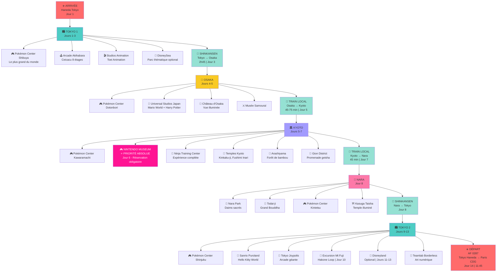

# 🎮 Japon 2026 - Aventure Pokémon & Parcs à Thème

Itinéraire complet pour un voyage de 14 jours au Japon (6-20 juillet 2026) centré autour de Pokémon, Nintendo et parcs à thème.

## 📋 Vue d'ensemble

| Aspect | Détail |
|--------|--------|
| **Dates** | 6 - 20 juillet 2026 |
| **Durée** | 14 jours / 13 nuits |
| **Route** | Tokyo → Osaka → Kyoto → Nara → Mont Fuji → Tokyo |
| **Budget** | ~920€ sur place |
| **Transport** | JR Pass 7j + trajets individuels |
| **Hôtels** | 2-3★ (550-1200¥/nuit) |

## 🗺️ Visualisation du voyage



## 🗺️ Itinéraire jour par jour

### Semaine 1 : Tokyo & Découverte
- **Jour 1** : Arrivée Tokyo (05:55 Haneda) + installation
- **Jour 2** : Pokémon Center Shibuya (le plus grand du monde) + Akihabara arcade
- **Jour 3** : Studios animation + DisneySea (optionnel) → Départ Osaka

### Semaine 2 : Kansai Region
- **Jour 4** : Pokémon Center Osaka + Universal Studios Japan (USJ) + Château d'Osaka
- **Jour 5** : Musée Samouraï (Osaka) → Kyoto + Pokémon Center Kyoto
- **Jour 6** : **NINTENDO MUSEUM (Kyoto)** - Jour complet réservé + temples Kyoto
- **Jour 7** : Ninja Training Center + Arashiyama bamboo grove → Nara
- **Jour 8** : Nara Park + Todai-ji + Pokémon Center Nara → Tokyo

### Semaine 3 : Tokyo & Conclusion
- **Jour 9** : Retour Tokyo + Sanrio Puroland (optionnel) + Tokyo Joypolis
- **Jour 10** : Excursion Mont Fuji & Hakone
- **Jours 11-13** : Jours flexibles (Disneyland, Teamlab, shopping, exploration)
- **Jour 14** : Départ Paris (11:45 Haneda)

## 🎯 Points forts

### 🎮 Pokémon Centers (5 visites confirmées)
1. **Tokyo Shibuya** - Le plus grand du monde | Jour 2
2. **Tokyo Shinjuku** - Centre-ville | Jour 2 & 9
3. **Osaka Dotonbori** | Jour 4
4. **Kyoto Kawaramachi** | Jour 5
5. **Nara** | Jour 8

### 🎢 Parcs & Attractions principales
- **Nintendo Museum (Kyoto)** - Réservation OBLIGATOIRE - Jour 6
- **Universal Studios Japan (Osaka)** - Super Mario World + Harry Potter | Jour 4
- **Tokyo Disneyland** (optionnel) - Jours 11-13
- **DisneySea** (optionnel) - Jour 3
- **Sanrio Puroland** (optionnel) - Jour 9
- **Tokyo Joypolis** - Arcade futuriste | Jour 9

### 🏯 Culture & Nature
- Temples historiques (Kyoto, Nara)
- Forêt de bambou Arashiyama
- Mont Fuji & lac Hakone
- Ninja Training Center (Kyoto)

## 💰 Budget estimation

```
Hébergement (13 nuits)    : ~10 800¥ (~75€)
Transport interne         : ~30 720¥ (~210€)
Parcs & attractions       : ~36 700¥ (~250€)
Pokémon & shopping        : ~20 000¥ (~135€)
Repas & divers            : ~37 500¥ (~255€)
─────────────────────────────────────────
TOTAL sur place           : ~135 720¥ (~920€)
```

*Note : Vols internationaux non inclus (Air France déjà payés)*

## 🎫 Priorités absolues

### 1. Nintendo Museum Kyoto ⚠️
- **Dates** : Jour 6 (16 juillet recommandé)
- **Réservation** : https://www.nintendo-museum.jp/en/
- **Créneau recommandé** : 10h-12h (après-midi libre)
- **Prix** : ~3000¥
- **Action** : Réserver immédiatement (juillet = haute saison)

### 2. Hôtels
- Booking.com, Agoda, jalan.net, rakuten.co.jp
- Réserver avant mai (juillet = haute saison)
- Budget 600-1000¥/nuit pour qualité correcte

### 3. USJ & autres parcs
- Réserver en ligne pour files courtes
- Shinkansen : réserver le moins tard possible

## 🚄 Transport - JR Pass ou à l'unité ?

| Option | Coût | Avantages |
|--------|------|-----------|
| **7-day JR Pass** | ~29 650¥ | Illimité Shinkansen, économe long trajet |
| **À l'unité** | ~25 000¥ | Plus flexible, légèrement moins cher |

**Conseil** : JR Pass 7j (jours 3-9) pour Tokyo→Osaka→Kyoto→Nara→Tokyo

## 📱 Conseils pratiques

### 💳 Argent & Paiements
- Retirer Yen à l'aéroport
- Peu de cartes acceptées → préférer espèces
- Suica/Pasmo rechargeable pour transports publics

### 📲 Connexion & Navigation
- SIM temporaire ou WiFi pocket à l'aéroport
- Google Maps (100% fiable au Japon)
- Google Translate pour étiquettes/menus

### 🎫 Billets & Réservations
- **Pokémon Centers** : walk-in (aucune réservation)
- **Parcs à thème** : réserver en ligne (files courtes)
- **Shinkansen** : réserver en ligne (sièges numérotés)

### 🗺️ Applications utiles
- Google Maps (transport public intégré)
- Hyperdia (horaires train détaillés)
- JR East Pass (app officielle)

## ✅ Checklist avant départ

**Réservations (URGENT)**
- [ ] Nintendo Museum Kyoto
- [ ] Hôtels (Tokyo, Osaka, Kyoto, Nara)
- [ ] USJ billets en ligne
- [ ] Disneyland (optionnel)
- [ ] Shinkansen Tokyo↔Osaka

**Préparation**
- [ ] Passeport valide (6+ mois)
- [ ] Assurance voyage
- [ ] JR Pass (à décider)
- [ ] SIM/WiFi pocket
- [ ] Google Maps hors-ligne

## 📄 Source

Itinéraire généré à partir du fichier HTML `japan_trip_itinerary.html` (27 avril 2026)

---

**🎮 Bon voyage au Japon ! 🗾**
